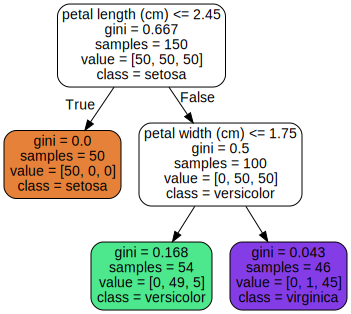
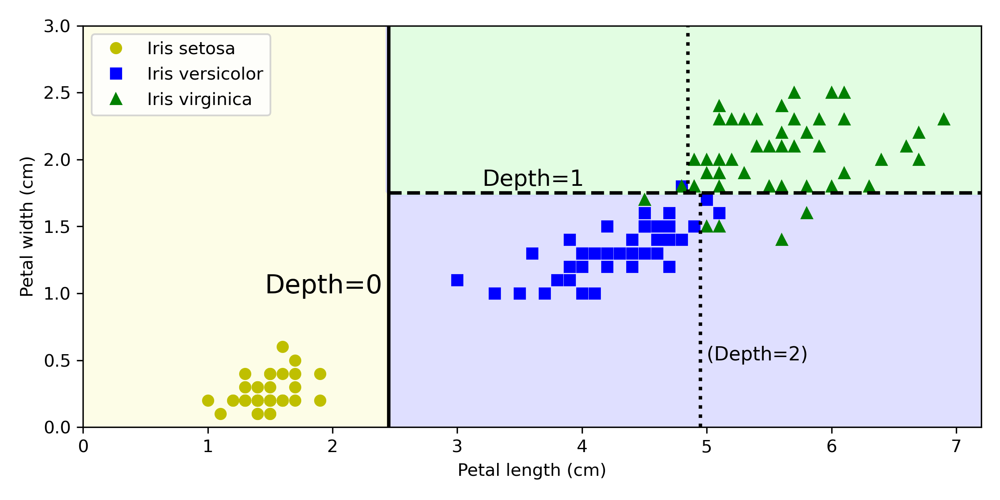
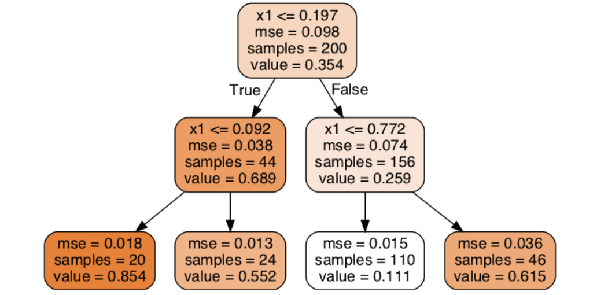
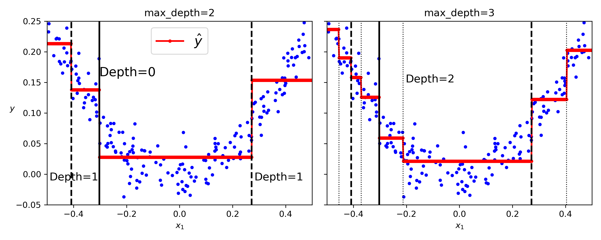
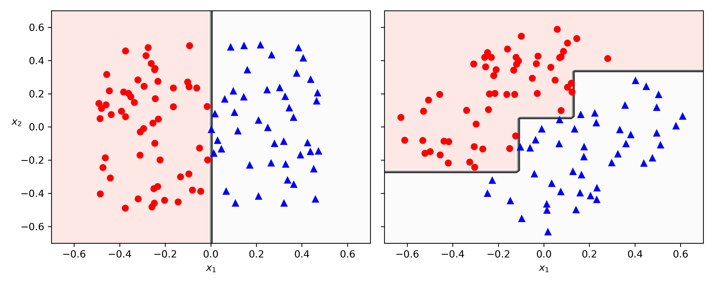
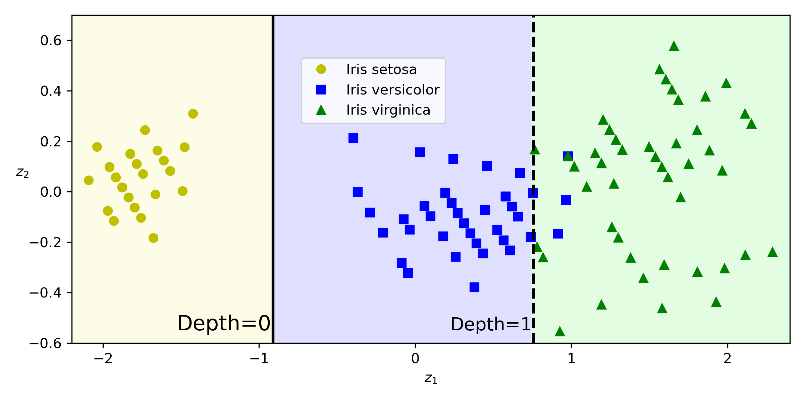
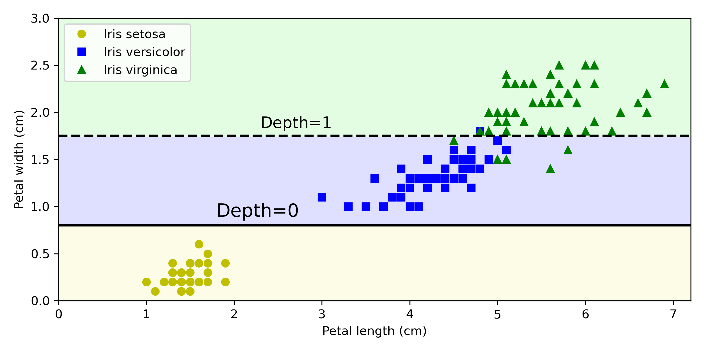

# Chapter 6 – Decision Trees

## What is Decision Tree

- Decision trees are versatile machine learning algorithms that can perform both clas sification and regression tasks, and even multioutput tasks.
- A non-parametric supervised learning algorithm.
- Decision trees make very few assumptions about the training data. 
  - If left unconstrained, the tree structure will adapt itself to the training data, fitting it very closely—indeed, most likely overfitting it. 

## Terminologies

- **Root Node**
  - The initial node at the beginning of a decision tree, where the entire population or dataset starts dividing based on various features or conditions.

- **Decision Nodes**
  - Nodes resulting from the splitting of root nodes are known as decision nodes. 
  - These nodes represent intermediate decisions or conditions within the tree.

- **Leaf Nodes**
  - Nodes where further splitting is not possible, often indicating the final classification or outcome. 
  - Leaf nodes are also referred to as **terminal nodes**.

- **Parent and Child Node**
  - Node that is divided into sub-nodes is known as a **parent node**, and the sub-nodes emerging from it are referred to as **child nodes**. 
  - The parent node represents a decision or condition, while the child nodes represent the potential outcomes or further decisions based on that condition.

- **Entropy**
  - The uncertainty in our dataset or measure of disorder.
-  **Gini impurity**: 
   - A node is **“pure” (gini=0)** if all training instances it applies to belong to the same class. 

## Comparision

### White Box & Black Box

- Decision trees are intuitive, and their decisions are easy to interpret. Such models are often called white box models. 

- In contrast, as you will see, random forests and neural networks are generally considered black box models. 
  - It is usually hard to explain in simple terms why the predictions were made. 
  - For example, if a neural network says that a particular person appears in a picture, it is hard to know what contributed to this prediction:    
    - Did the model recognize that person’s eyes? Their mouth? Their nose? Their shoes? Or even the couch that they were sitting on? 

### Parametric & Non Parametric Models

- Nonparametric model
  - The number of parameters is not determined prior to training, so the model structure is free to stick closely to the data. 
- Parametric model, such as a linear model, has a predetermined number of parameters, so its degree of freedom is limited, reducing the risk of overfitting (but increasing the risk of underfitting)

**Note:** One of the many qualities of decision trees is that they require very little data preparation. In fact, they don’t require feature scaling or centering at all

## How decision tree algorithms work?

1. **Starting at the Root**
   - The algorithm begins at the top, called the “root node,” representing the entire dataset.

2. **Asking the Best Questions**
   - It looks for the most important feature or question that splits the data into the most distinct groups.

3. **Branching Out**
   - Based on the answer to that question, it divides the data into smaller subsets, creating new branches.
   - Each branch represents a possible route through the tree.

4. **Repeating the Process** 
   - The algorithm continues asking questions and splitting the data at each branch until it reaches the final “leaf nodes,” representing the predicted outcomes or classifications.

### Visualize
##### Suppose you find an iris flower and you want to classify it based on its petals.

    

- Start at the root node **(depth 0, at the top)**: 
- If the flower’s petal length is smaller than 2.45 cm. 
  - It move down to the root’s left child node (depth 1, left). 
    - it is a leaf node, so it does not ask any questions: 
      - simply look at the predicted class for that node, and the decision tree predicts that your flower is an Iris setosa **(class=setosa)**.
  
- Now suppose you find another flower, and this time the petal length is greater than 2.45 cm.
  - You again start at the root but now move down to its right child node (depth 1, right). 
    - It’s a split node, so it asks another question: **is the petal width smaller than 1.75 cm?** 
      - If it is, then your flower is most likely an **Iris versicolor (depth 2, left)**. 
      - If not, it is likely an Iris virginica **(depth 2, right)**.
  

#### Node’s Samples Attribute
- A node’s samples attribute counts how many training instances it applies to. 
  - 100 training instances have a petal length greater than 2.45 cm (depth 1, right), 
    - those 100, 54 have a petal width smaller than 1.75 cm (depth 2, left). 
#### Node’s value attribute
- A node’s value attribute tells you how many training instances of each class this node applies to: 
  - The bottom-right node applies to 0 Iris setosa, 1 Iris versicolor, and 45 Iris virginica. 
#### Gini Attribute
- Node’s gini attribute measures its Gini impurity
  - For example, since the depth-1 left node applies only to Iris setosa training instances, it is pure and its Gini impurity is 0. 
- Gini impurity Equation 
$$G_i = 1 − \sum_{n=1}^n pi, k^2$$

  
## Making Predictions

    

- The thick vertical line represents the decision boundary of the root node **(depth 0): petal length = 2.45 cm**. 
  - Since the lefthand area is pure (only Iris setosa), it cannot be split any further.
- The righthand area is impure, so
  - The **depth-1** right node splits it at petal width = 1.75 cm (represented by the dashed line). 
  - Since max_depth was set to 2, the decision tree stops right there. 
  - If you set max_depth to 3, then the two **depth-2** nodes would each add another decision boundary (represented by the two vertical dotted lines).

## Estimating Class Probabilities
- A decision tree can also estimate the probability that an instance belongs to a particular class k. 
- First it traverses the tree to find the leaf node for this instance, and then it returns the ratio of training instances of class k in this node. 
  - For example, suppose you have found a flower whose petals are 5 cm long and 1.5 cm wide. 
    - The corresponding leaf node is the depth-2 left node, so the decision tree outputs the following probabilities: 
    - 0% for Iris setosa (0/54), 90.7% for Iris versicolor (49/54), and 9.3% for Iris virginica (5/54). 
    - And if you ask it to predict the class, it outputs Iris versicolor (class 1) because it has the highest probability. Let’s check this:

Perfect! Notice that the estimated probabilities would be identical anywhere else in the bottom-right rectangle of Figure 6-2—for example, if the petals were 6 cm long and 1.5 cm wide (even though it seems obvious that it would most likely be an Iris virginica in this case).

## The CART Training Algorithm

- Scikit-Learn uses the Classification and Regression Tree (CART) algorithm to train decision trees (also called “growing” trees). 
- The algorithm works by first splitting the training set into two subsets using a single feature k and a threshold $t_k$ (“petal length ≤ 2.45 cm”). 
- How does it choose k and $t_k$ It searches for the pair (k, $t_k$)that produces the purest subsets, weighted by their size. 
- Equation 6-2 gives the cost function that the algorithm tries to minimize.
Equation 6-2. CART cost function for classification
$$J(k, t_k) = \frac{m_{left}}{m}G_{left} + \frac{m_{right}}{m}G_{right}$$

$$
where\begin{cases}
			G_{left/right} & \text{measures the impurity of the left/right subset}\\
            m_{left/right} & \text{is the number of instances in the left/right subset}
		 \end{cases}
$$

- Once the CART algorithm has successfully split the training set in two, it splits the subsets using the same logic, then the sub-subsets, and so on, recursively. 
- It stops recursing once it reaches the maximum depth (defined by the max_depth hyperparameter), or if it cannot find a split that will reduce impurity. 
- A few other hyperparameters control additional stopping conditions: 
  - min_samples_split
  - min_samples_leaf
  - min_weight_fraction_leaf
  - and max_leaf_nodes

- The CART algorithm is a greedy algorithm: 
  - it greedily searches for an optimum split at the top level, then repeats the process at each subsequent level. 
- It does not check whether or not the split will lead to the lowest possible impurity several levels down. 
- A greedy algorithm often produces a solution that’s reasonably good but not guaranteed to be optimal. 
- Unfortunately, finding the optimal tree is known to be an NPcomplete problem. It requires $O(exp(m))$ time, making the problem intractable even for small training sets. This is why we must settle for a “reasonably good” solution when training decision trees

## Gini Impurity or Entropy?

- By default, the DecisionTreeClassifier class uses the **Gini impurity measure**

- In machine learning, entropy is frequently used as an impurity measure: 
    - a set’s entropy is zero when it contains instances of only one class. 
- Equation shows the definition of the entropy of the ith node. 
  - $$H_i = - \sum_{k=1}^n p_i,k\ log_2(p_i, k)$$

### Should you use Gini impurity or entropy? 
- Most of the time it does not make a big difference: they lead to similar trees. 
- Gini impurity is slightly faster to compute, so it is a good default. 
- However, when they differ
  - Gini impurity tends to isolate the most frequent class in its own branch of the tree
  - while entropy tends to produce slightly more balanced trees

## Regularization Hyperparameters

- To avoid overfitting the training data, you need to restrict the decision tree’s freedom during training. this is called **regularization**. 
- The regularization hyperparameters depend on the algorithm used, but generally you can at least restrict the maximum depth of the decision tree.
  
- In Scikit-Learn, this is controlled by the **max_depth** hyperparameter. 

## Regression

    

- Suppose you want to make a prediction for a new instance with **x1 = 0.2**. 
    - The root node asks whether **x1 ≤ 0.197**. 
      - Since it is not, the algorithm goes to the right child node, which asks whether **x1 ≤ 0.772**. 
        - Since it is, the algorithm goes to the left child node. This is a leaf node, and it predicts **value=0.111**. 
    - This prediction 
      - is the average target value of the 110 training instances associated with this leaf node, 
      - and it results in a mean squared error equal to 0.015 over these 110 instances.

    

- This model’s predictions are represented on the left in Figure 6-5. 
- If you set max_depth=3, you get the predictions represented on the right. 
- Notice how the predicted value for each region is always the average target value of the instances in that region. 
- The algorithm splits each region in a way that makes most training instances as close as possible to that predicted value.

## Sensitivity to axis orientation

### Decision Tree limitations. 
- Decision trees love orthogonal decision boundaries (all splits are perpendicular to an axis), which makes them **sensitive to the data’s orientation**. 

- For example, Figure 6-7 shows a simple linearly separable dataset: 
  - on the left, a decision tree can split it easily, 
  - while on the right, after the dataset is rotated by 45°, the decision boundary looks
unnecessarily convoluted. 

    

- Although both decision trees fit the training set perfectly, it is very likely that the model on the right will not generalize well One way to limit this problem is to scale the data, then apply a principal component analysis transformation.  
- but for now you only need to know that it rotates the data in a way that reduces the correlation between the features, which often (not always) makes things easier for trees.

- Let’s create a small pipeline that scales the data and rotates it using PCA, then train a
DecisionTreeClassifier on that data. Figure 6-8 shows the decision boundaries of
that tree: as you can see, the rotation makes it possible to fit the dataset pretty well
using only one feature, z1, which is a linear function of the original petal length and
width. Here’s the code:

    

## Decision Trees Have High Variance
- More generally, the main issue with decision trees is that they have quite a high
variance: 
  - small changes to the hyperparameters or to the data may produce very
different models. 
- In fact, since the training algorithm used by Scikit-Learn is stochasticit randomly selects the set of features to evaluate at each node—even retraining the same decision tree on the exact same data may produce a very different model, such as the one represented in Figure 6-9 (unless you set the random_state hyper‐
parameter). As you can see, it looks very different from the previous decision tree
(Figure 6-2)

    

Luckily, by averaging predictions over many trees, it’s possible to reduce variance
significantly. Such an ensemble of trees is called a random forest, and it’s one of the
most powerful types of models available today, as you will see in the next chapter.

**Note**
- Scikit-Learn uses the CART algorithm, which produces only binary trees, meaning trees where split nodes always have exactly two children (i.e., questions only have yes/no answers). However, other algorithms, such as ID3, can produce decision trees with nodes that have more than two children.